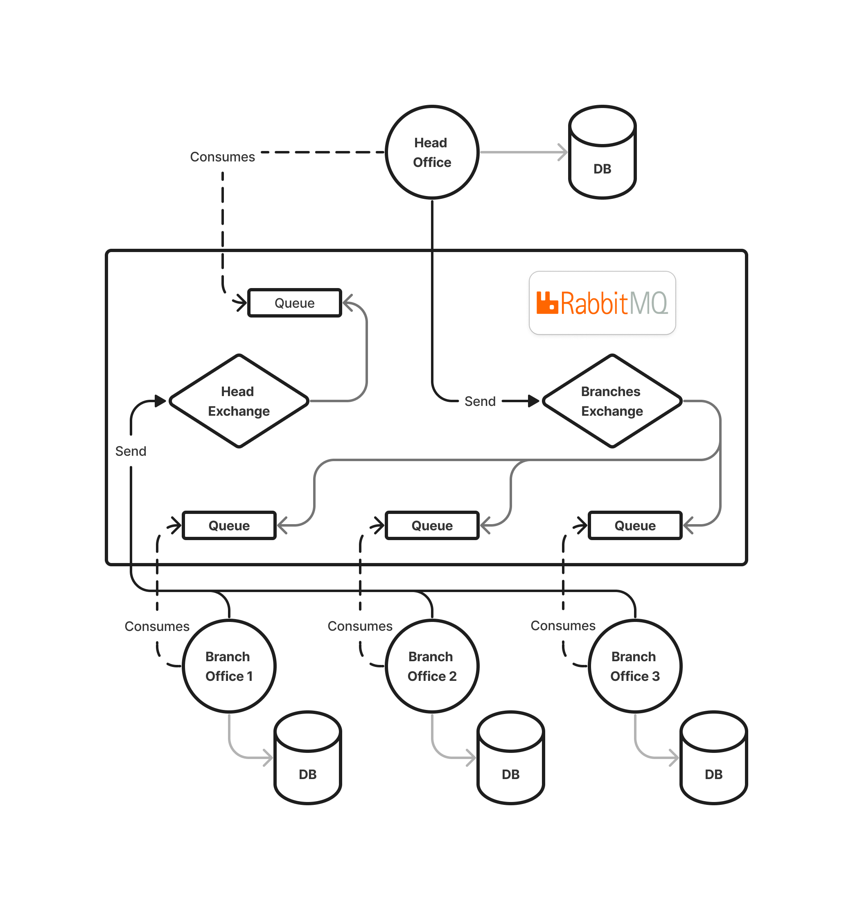

# Database Synchronization System

[](https://www.rabbitmq.com)
[](https://nestjs.com)
[](https://www.docker.com)
[](https://kubernetes.io)

## Overview

This database synchronization system addresses the challenge of synchronizing distributed databases in a scenario with unique constraints. In a setup comprising a Head Office (HO) and multiple Branch Offices (BOs) spread across different locations, including areas with limited internet connectivity, traditional synchronization methods prove inadequate. To overcome these challenges, this solution leverages RabbitMQ message queues to facilitate efficient data exchange between offices.

## Features Roadmap

-  [x] Abstraction over the number of branch offices (BOs), allowing for dynamic scalability.
-  [x] Support for any kind of operation on the database (Create, Update, Delete).
-  [x] Database-agnostic (SQL databases for now).
-  [x] Manual synchronization of databases across multiple offices.
-  [ ] Automatic synchronization upon internet outage recovery.
-  [ ] Real-time synchronization.
-  [ ] Support for dynamic schema evolution.

## Project Structure

The project follows a monorepo style structure, organized into the following directories:

-  `apps/`: Contains the source code for both the head office and branch office applications.

   -  `apps/head/`: Source code for the head office application.
   -  `apps/branch/`: Source code for the branch office application.

-  `docs/`: Contains other relevant documentation apart from the README.md.

-  `libs/`: Contains modules that are shared between the two applications.

-  `orchestration/`: Contains Kubernetes configuraton files that describe how the app deployment and management should be orchestrated.

-  `scripts/`: Contains various scripts required to start the entire system.

## How it works ?

We will talk about how RabbitMQ makes it easy to manage communications between the different offices 
and then we will tackle how synchronization works.

If you don't know about RabbitMQ, you can read more about it [here](docs/rabbitmq.md) or you can google it and come back later.

### RabbitMQ

There are 3 main entities envolved:
- RabbitMQ broker
- Head Office
- Branch Office

Each office has its own queue to consume messages from.
This way, even if the recipient is not available, the sender can still send its messages and the recipient will consume them when it's back.

Communications happen only between HO and BOs, so no inter-communications between BOs.

We will have 2 `fanout` exchanges:
- One that recieves messages from the BOs and forwards them to the HO queue.
- One that recieves messages from the HO and forwards them to each BO queue.

The concept of exchanges is what will enable adding or removing BOs without the need to change any office's configuration or RabbitMQ's.



### Synchronization

TODO

## Installation and Setup

> [!NOTE]
> The installation process has been thoroughly tested on a Debian machine and is expected to work smoothly on all Unix-based systems. <br>
> However, it is important to note that compatibility with other operating systems, such as Windows, cannot be guaranteed.

First, clone the repository.

```sh
git clone https://github.com/omar-besbes/database-synchronization-app.git
```

<details> 
<summary> Using <code>kubectl</code> (Recommended) </summary>
<br>

If you want the full experience, you have to use kubernetes.
This includes the following:
- having multiple BOs
- on-demand scaling of BOs

You have to make sure that you have a cluster in your system.
This can be achieved by installing a tool like [minikube](https://minikube.sigs.k8s.io/docs/start/).

To verify that you have a cluster, run:

```sh
kubectl get po -A
```

You should get an output like this:

```sh
NAMESPACE              NAME                                         READY   STATUS   RESTARTS        AGE
kube-system            coredns-5dd5756b68-cqwk6                     1/1     Running   1 (11h ago)     18h
kube-system            etcd-minikube                                1/1     Running   1 (11h ago)     18h
kube-system            kube-apiserver-minikube                      1/1     Running   1 (3h20m ago)   18h
kube-system            kube-controller-manager-minikube             1/1     Running   1 (11h ago)     18h
kube-system            kube-proxy-mcjpb                             1/1     Running   1 (11h ago)     18h
kube-system            kube-scheduler-minikube                      1/1     Running   1 (11h ago)     18h
kube-system            storage-provisioner                          1/1     Running   3 (3h19m ago)   18h
kubernetes-dashboard   dashboard-metrics-scraper-7fd5cb4ddc-sg5k5   1/1     Running   1 (11h ago)     18h
kubernetes-dashboard   kubernetes-dashboard-8694d4445c-jnjwm        1/1     Running   2 (3h19m ago)   18h
```

Please, either:

-  copy the scripts folder under `orchestration/shared` using: `cp -r scripts/ orchestration/shared/`
-  or (I personally prefer this) create a hard link for each file under `scripts` in `orchestration/shared/scripts`
   using: `ln  scripts/* orchestration/shared/scripts/`

To get our system up and running, please run this:

```sh
kubectl apply -k orchestration/head-office/
kubectl apply -k orchestration/branch-office/
```

This will generate the necessary config maps for the 3 deployments (rabbitmq broker, head office and branch office) to start.

If you are using `minikube`, you can visualize your cluster by running:

```sh
minikube dashboard
```

</details>

<details> 
<summary> Using <code>docker compose</code> (Recommended) </summary>
<br>

If you just want to quickly this system working without needing multiple branch offices,
this methods suits your need. This will run a single HO and a single BO connected through RabbitMQ broker.

To get our system up and running, please run this:

```sh
./scripts/generate_secrets.sh > .env
./scripts/generate_ssl_certificates.sh >> .env
docker compose up
```

This will generate a `.env` file containing the necessary credentials and ssl certificates in order for the databases to start.

</details>

<details> 
<summary> Manually </summary>
<br>

I don't have any idea why someone would want to start the whole system manually.
For the sake of completeness, here it is.

We will first show how to set up a HO and a single BO and then how to add other BO.

### Starting the system with a single branch office

1. Install dependencies

```sh
yarn
```

2. Configure the application settings

-  make sure you have a relational database up and running for each office you plan on running.
-  make sure you have a RabbitMQ instance up and running. You can find out how to install and set up a RabbitMQ instance
   locally [here](https://rabbitmq.com), or you can use managed RabbitMQ instance [here](https://www.cloudamqp.com).
-  use the `.env.example` files (there is one in `apps/head` for the head office and one in `apps/branch` for branch
   offices) to generate `.env` for each office. Put them besides the corresponding `.env.example` files.

3. Build & start the applications

```sh
# build step
# you only have to run this once for all offices
yarn build head && yarn build branch
# start step
# you have to run these in separate shell sessions
yarn start head # start the HO
yarn start branch # start a BO
```

### Adding branch offices

This is the tricky part, we can not use the same `.env` for all branch offices. The environment variables are crucial
for how the whole system will work. So, to use multiple branch offices, we have to start them one by one. For each one,
we change the `.env` file and start a new branch office. Notice that changing the `.env` will not affect the already
running instances as environment variables are loaded at startup and are never checked afterward. This is also why it is
important to wait for the branch office app to start before moving on to another.

</details>

## Why Kubernetes ?

In the setup section, Kubernetes is utilized for orchestrating the deployment. However, the system itself does not inherently leverage Kubernetes features such as load balancing or auto-scaling. Instead, Kubernetes is chosen primarily for simplifying testing and demonstrations.

In real-world deployments, where offices are geographically dispersed and may operate on separate physical servers, Kubernetes may not be necessary.


## Forking and Customization

If you intend to fork this project and customize it to your needs, here are some considerations:

### Database Agnosticism

The codebase is designed to be database agnostic for **relational** databases. This means that
theoretically, each office could use a different SQL database without encountering major compatibility issues.
However, it's important to note that this feature has not been tested.

To minimize risk and ensure proper functionality, it's recommended to conduct thorough testing when deploying the system
with different RDBMS systems.

Additionally, any specific database-related configurations or queries should be carefully reviewed and adjusted as
needed to ensure compatibility with the chosen database platform. Although, in my opinion, if changing to different
RDBMS systems will require having changes to queries, making this change defeats the whole purpose of having a single
code for multiple instances.

## Contributing

Contributions are welcome! Please clone the repository, make your changes, and submit a pull request.
